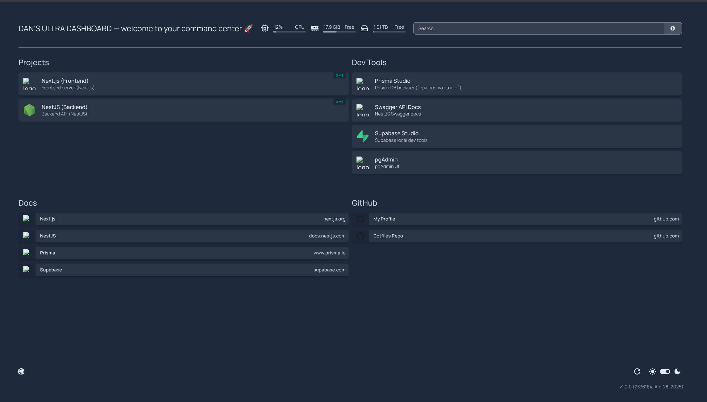

# 🧠 Dev Dashboard



A self‑hosted developer dashboard powered by [Homepage](https://gethomepage.dev) to monitor and launch all local development tools.

---

## 🧰 Features

- 📊 **CPU / RAM / Disk** usage widgets  
- 🛠 **Quick links** to local dev services:  
  - Next.js (Frontend)  
  - NestJS (Backend API)  
  - Prisma Studio  
  - Supabase Studio  
  - Swagger Docs  
  - pgAdmin  
- 📚 **Bookmarks** to docs (Next.js, NestJS, Prisma, Supabase)  
- 📂 **Fully YAML‑configurable**  
- 🐳 **Dockerized** — easy to launch and manage

---

## 🚀 Getting Started

### 1. Clone this repo
```bash
git clone https://github.com/Dantegro/dev-dashboard.git
cd dev-dashboard
```

### 2. Run with Docker Compose
```bash
docker compose up -d
```
Open your browser at **http://localhost:3001**.

---

## 🧾 Project Structure
```text
.
├── config/
│   ├── config.yaml      # Global dashboard settings
│   ├── services.yaml    # Service definitions (Next.js, NestJS, etc.)
│   ├── bookmarks.yaml   # Documentation & GitHub links
│   └── widgets.yaml     # CPU / RAM / search widgets
└── docker-compose.yml   # Launches the Homepage container
```

---

## 🧠 Credits

This dashboard is powered by [Homepage](https://gethomepage.dev), a modern, customizable dashboard for developers and self‑hosters.  
Emoji icons by [Twemoji](https://twemoji.twitter.com/).
